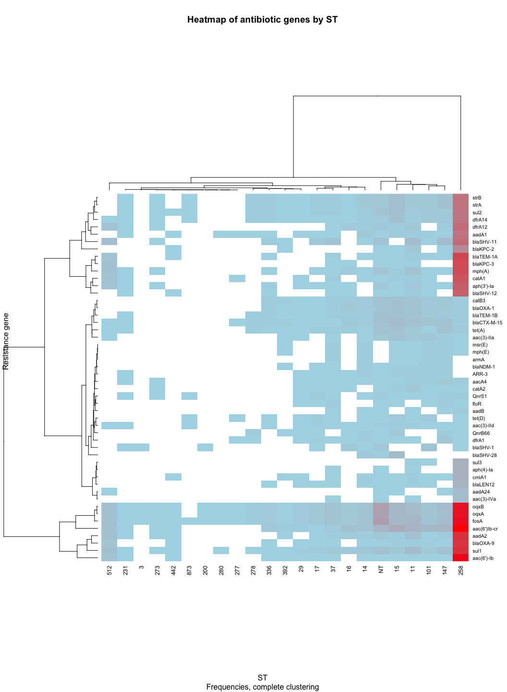
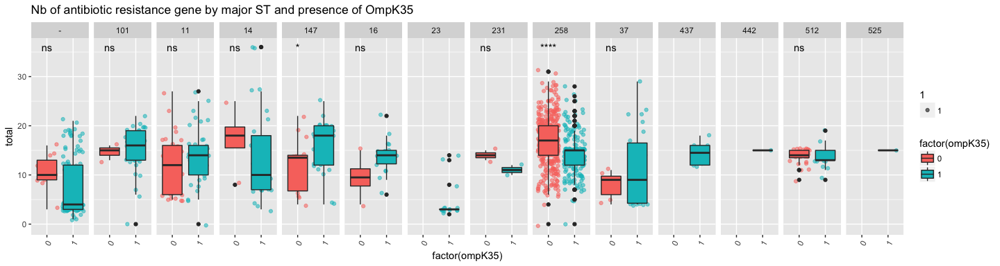

# KP_resistance_determinants_EDA
Nouri L. BEN ZAKOUR  
12 July 2018  


```r
# Libraries
#install.packages("heatmaply")
#install.packages("tidyverse")

### Setting up environment and loading data

#
library(plyr)
library(dplyr)
```

```
## 
## Attaching package: 'dplyr'
```

```
## The following objects are masked from 'package:plyr':
## 
##     arrange, count, desc, failwith, id, mutate, rename, summarise,
##     summarize
```

```
## The following objects are masked from 'package:stats':
## 
##     filter, lag
```

```
## The following objects are masked from 'package:base':
## 
##     intersect, setdiff, setequal, union
```

```r
library(reshape2)
library(ggplot2)
library(knitr)
library(scales)
library(gtools)
library(gridExtra)
```

```
## 
## Attaching package: 'gridExtra'
```

```
## The following object is masked from 'package:dplyr':
## 
##     combine
```

```r
library(png)
library(circlize)
library(ggpubr)
```

```
## Loading required package: magrittr
```

```r
## color palette
library(grDevices)
library(gplots)
```

```
## 
## Attaching package: 'gplots'
```

```
## The following object is masked from 'package:stats':
## 
##     lowess
```

```r
library(RColorBrewer)

### Loading data

bap <- read.csv2("../data/KP_screening_data.csv", header = TRUE, sep = ",", na.strings = "", stringsAsFactors = FALSE)

### Summary
#summary(bap)
```

Resistance determinants
-----------------------

**Exploring further: distribution of major resistance determinants identified**
Data presented below focuses on the top 50 resistance genes identified in the collection.


```r
### generate resistance matrix from BAP profile data and merge existing tables

## count most frequent resistance genes (can't use count() on single column)
# split data by comma and put in a unique list then convert to dataframe
# add column name
# arrange by descending values of frequency

resdata <- data.frame(table(unlist(strsplit(bap$resistance_genes, ','))))
names(resdata)[1] = 'resistance_gene'
resdata <- arrange(resdata,desc(Freq))

# extract top 50 as a character vector and sort alphabetically
#resdata <- filter(resdata, Freq>1)
resgenes <- as.character(resdata$resistance_gene[0:50])   ### <- change here to increase cut-off
resgenes <- sort(resgenes)

# display top frequent alleles found
resdata[0:ncol(resdata),]
```

```
##   resistance_gene Freq
## 1            fosA 1550
## 2            oqxB 1491
```

```r
# generate empty res matrix
res_mat <- data.frame(matrix(nrow = nrow(bap), ncol = (length(resgenes)+1)), stringsAsFactors = FALSE)
colnames(res_mat) <- (c("Id", resgenes))

# add Id from bap table
res_mat$Id <- bap$Id

# populate matrix
for (resgene in resgenes) {
  # record position of resgene to assign column properly in res_mat
  pos = match(resgene,resgenes)

  for (i in 1:nrow(bap)) {
    reslist <- unlist(strsplit(bap$resistance_genes[i], ','))
    occ <- 0
    
    # check if reslist contains "NA"
    if (all(is.na(reslist))) {
      ### populate matrix with occurence results
      res_mat[i, pos+1] <- occ      
    }  
    else {
      for (j in 1:length(reslist)) { 
        # check and count occurences of resgene in reslist
        if (resgene == reslist[[j]]) {
          occ <- occ + 1
          j <- j + 1
        }
        else { 
          j <- j + 1 
        }
      ### populate matrix with occurence results
      res_mat[i, pos+1] <- occ
      }
    }
  }
}

### display freqs
# colSums(res_mat[2:ncol(res_mat)])

### merge data to main matrix
bapmatres <- full_join(bap, res_mat, by = "Id")

### export table for visualisation purpose
# out <- res_mat
# out <- as.matrix(out)
# rownames(out) <- out[, 1]               ## add name
# test <- test[, -1]                        ## remove 1st column
# col.order <- hclust(dist(t(out)))$order  ## reorder columns using hierarchical clustering
# out2 <- out[, col.order]
# write.csv(out,"reorder_res_mat.csv")
```


```r
res_mat_ST <- merge(x = res_mat, y = bap[, c("Id", "ST")], by = "Id", all.x=TRUE)

# replace empty fields by NA
res_mat_ST$ST <- sub("^$", NA, res_mat_ST$ST)

# convert as.numeric to sort by ST
res_mat_ST$ST <- as.numeric(res_mat_ST$ST)
```

```
## Warning: NAs introduced by coercion
```

```r
res_mat_ST <- res_mat_ST[order(res_mat_ST$ST), ]

# calculate sum by ST for each column (resgene) and add 1st column unique ST ID)
res_freq_ST <- cbind(unique(res_mat_ST$ST),ddply(res_mat_ST[, 2:(ncol(res_mat_ST))], "ST", colSums))

# remove last column which contains sum(ST)
res_freq_ST <- res_freq_ST[,1:(ncol(res_freq_ST)-1)]
colnames(res_freq_ST)[1] <- "ST"

# build frequences data for Res_Type by ST
freqpairs <- melt(res_freq_ST, "ST")
freqpairs$ST <- as.character(freqpairs$ST)

ggplot(freqpairs, aes(x = ST, y = value, fill = variable)) + geom_col(position = position_stack(reverse = TRUE), colour="black", size=0.2) + theme(axis.text.x=element_text(angle=60, hjust=1)) + ggtitle("Distribution of most frequent alleles by ST")
```

<!-- -->


```r
# build frequences data for Type_family by Subgroup

freqpairs <- melt(res_freq_ST, "ST")
freqpairs$ST[is.na(freqpairs$ST)] <- "NT"
#freqpairs <- filter(freqpairs, freqpairs$value >2)
significant <- c('NT', '101', '11', '14', '147', '278', '280', '15', '16', '17', '120', '200', '231', '258', '127', '273', '277', '29', '278', '3', '336', '37', '392', '442', '512', '873')
freqpairs <- filter(freqpairs, ST %in% significant) %>% na.omit()

##############

circos.clear()
circos.par(gap.after = c(rep(1, length(unique(freqpairs[[1]]))-1), 8, rep(1, length(unique(freqpairs[[2]]))-1), 8))
grid.col = c(NT = "grey", "258" = "red")

#circos.par(start.degree = 270, clock.wise = FALSE)
chordDiagram(freqpairs, 
             annotationTrack = c("grid", "axis"), 
             preAllocateTracks = list(track.height = 0.1), 
             link.sort = TRUE, link.decreasing = TRUE, 
             grid.col = grid.col,
             #directional = -1, direction.type = c("diffHeight", "arrows"), link.arr.type = "big.arrow",
             order = c((mixedsort(unique(freqpairs[[1]]), decreasing = TRUE)), as.character(mixedsort(unique(freqpairs[[2]])))))
  circos.trackPlotRegion(track.index = 1, panel.fun = function(x, y) {
  xlim = get.cell.meta.data("xlim")
  xplot = get.cell.meta.data("xplot")
  ylim = get.cell.meta.data("ylim")
  sector.name = get.cell.meta.data("sector.index")
  if(abs(xplot[2] - xplot[1]) < 20) {
    circos.text(mean(xlim), ylim[1], sector.name, facing = "clockwise",
                niceFacing = TRUE, adj = c(0, 0.5))
  } else {
    circos.text(mean(xlim), ylim[1], sector.name, facing = "inside",
                niceFacing = TRUE, adj = c(0.5, 0))
  }
}, bg.border = NA)
```

<!-- -->

```r
circos.clear()
```


```r
freqpairs2 <- filter(freqpairs, ST %in% significant) %>% na.omit()
ggplot(freqpairs2, aes(ST, variable)) + geom_tile(aes(fill = value), colour = "white") + scale_fill_gradient(low = "lightblue", high = "red") + geom_text(aes(label = value)) + ggtitle("Distribution of res genes types by ST")
```

<!-- -->

```r
### normalised by column
freqpairs2_rescale <- ddply(freqpairs2, .(ST), transform, rescale = rescale(value))
ggplot(freqpairs2_rescale, aes(ST, variable)) + geom_tile(aes(fill = rescale), colour = "white") + scale_fill_gradient(low = "lightblue", high = "red") + geom_text(aes(label = value)) + ggtitle("Distribution of res genes types by ST, rescaled by column")
```

<!-- -->


```r
### Sorting works but ggplot figure doesn't use the correct order, although df_molten_dat seems correct
heat <- dcast(data = freqpairs2, formula = ST~variable, fun.aggregate = sum, value.var = "value")
heat[is.na(heat)] <- 0
rownames(heat) <- heat[,1]
heat2 <- heat[,-1]

## reorder col and rows
row.order <- hclust(dist(heat2[,-1]))$order # clustering
col.order <- hclust(dist(t(heat2[,-1])))$order
dat_new <- heat2[row.order, col.order] # re-order matrix accoring to clustering
df_molten_dat <- melt(as.matrix(dat_new)) # reshape into dataframe
names(df_molten_dat)[c(1:2)] <- c("ST", "variable")
df_molten_dat[df_molten_dat < 1] <- NA # transform back 0 into NA
```

```
## Warning in Ops.factor(left, right): '<' not meaningful for factors

## Warning in Ops.factor(left, right): '<' not meaningful for factors
```

```r
hmcol <- colorRampPalette(brewer.pal(9, "GnBu"))(100)
breaks = seq(0, max(heat2),length.out=1000)
gradient1 = colorpanel( sum( breaks[-1]<1), "white", "white")
gradient2 = colorpanel( sum( breaks[-1]>=1 ), "lightblue", "red" )
hmcol2 = c(gradient1,gradient2)

# default clustering is set for hclust (complete)
heatmap(as.matrix(t(heat2)), scale="none", col = hmcol2)
title(main="Heatmap of antibiotic genes by ST", sub = "Frequencies, complete clustering", xlab = "ST", ylab = "Resistance gene")
```

<!-- -->

```r
# default clustering is set for hclust (complete)
heatmap(as.matrix(t(heat2)), scale="column", col = hmcol2)
title(main="Heatmap of antibiotic genes by ST, scaled by column", sub = "Frequencies, complete clustering", xlab = "ST", ylab = "Resistance gene")
```

<!-- -->


Porine defects in the context of resistance determinants
--------------------------------------------------------

**Supplemental figure S11**


```r
res_mat_ST <- merge(x = res_mat, y = bap[, c("Id", "ST")], by = "Id", all.x=TRUE)
res_mat_ST_porine <- merge(x = res_mat_ST, y = bap[, c("Id", "Insertion", "ompK36", "ompK35")], by = "Id", all.x=TRUE)
collec <- cbind(res_mat_ST_porine[,(ncol(res_mat_ST_porine)-3):ncol(res_mat_ST_porine)],"total" = rowSums(res_mat_ST_porine[2:(ncol(res_mat_ST_porine)-4)]))

significant <- c('-', '11', '14', '16', '23', '37', '101', '147','231', '258', '437', '442', '512', '525')
collec_sig <- filter(collec, ST %in% significant) #%>% na.omit()

## requires ggpubr
collec_sig[is.na(collec_sig)] <- "-"
#compare_means(total ~ ST, data = collec_sig, group.by = "Insertion", method = "kruskal.test")

# boxplots

ggplot(collec_sig, aes(y = total, x = Insertion )) + geom_jitter(aes(alpha=1, colour = factor(ompK35))) + geom_boxplot(aes(fill = Insertion)) + scale_fill_manual(values=c("grey", "red", "dark red")) + facet_grid(. ~ ST) + theme(axis.text.x=element_text(angle=60, hjust=1)) + ggtitle("Nb of antibiotic resistance gene by ST harbouring ompK36 mutants and insertion type") + stat_compare_means(label = "p.signif", ref.group = "-")
```

```
## Warning: Computation failed in `stat_compare_means()`:
## Can't find specified reference group: 1. Allowed values include one of: 2

## Warning: Computation failed in `stat_compare_means()`:
## Can't find specified reference group: 1. Allowed values include one of: 2
```

<!-- -->

**Exploring further**


```r
# boxplots 
ggplot(collec_sig, aes(y = total, x = factor(ompK35) )) + geom_jitter(aes(alpha=1, colour = factor(ompK35))) + geom_boxplot(aes(fill = factor(ompK35))) + facet_grid(. ~ ST) + theme(axis.text.x=element_text(angle=60, hjust=1)) + ggtitle("Nb of antibiotic resistance gene by major ST and presence of OmpK35") + stat_compare_means(label = "p.signif", ref.group = "1")
```

```
## Warning: Computation failed in `stat_compare_means()`:
## `group1`, `p` must resolve to integer column positions, not NULL

## Warning: Computation failed in `stat_compare_means()`:
## `group1`, `p` must resolve to integer column positions, not NULL

## Warning: Computation failed in `stat_compare_means()`:
## `group1`, `p` must resolve to integer column positions, not NULL

## Warning: Computation failed in `stat_compare_means()`:
## `group1`, `p` must resolve to integer column positions, not NULL
```

<!-- -->


```r
significant <- c('-', '101', '11', '14', '147', '278', '280', '15', '16', '17', '120', '200', '23', '231', '258', '127', '273', '277', '29', '278', '3', '336', '37', '392', '442', '512', '873')

### blaKPC gene by major ST and insertion type
subset <- cbind(res_mat_ST_porine$`blaKPC-2`, res_mat_ST_porine$`blaKPC-3`, res_mat_ST_porine$`blaKPC-4`, res_mat_ST_porine$`blaKPC-6`, res_mat_ST_porine$`blaKPC-9`)
collec <- cbind(res_mat_ST_porine[,(ncol(res_mat_ST_porine)-3):ncol(res_mat_ST_porine)],"total" = rowSums(subset))
collec_sig <- filter(collec, ST %in% significant) #%>% na.omit()
collec_sig_summary <- filter(as.data.frame(with(collec_sig, table(ST, Insertion, ompK36, ompK35, total))), Freq > 0)
# filter by freq cut-off of unique occurence (ST-Country-Year)
p1 <- ggplot(collec_sig_summary, aes(y = total, x = Insertion )) + geom_jitter(aes(size= Freq, alpha=1, colour = factor(ompK35)), width = 0.25, height = 0.1) + facet_grid(. ~ ST) + theme(axis.text.x=element_text(angle=60, hjust=1)) + ggtitle("Strains with blaKPC genes by major ST, ompK36 presence and insertion type") + scale_size_area(max_size = 13) 

### blaCTX-M-15 gene by major ST and insertion type

subset <- cbind(res_mat_ST_porine$`blaCTX-M-15`)
collec <- cbind(res_mat_ST_porine[,(ncol(res_mat_ST_porine)-3):ncol(res_mat_ST_porine)],"total" = rowSums(subset))
collec_sig <- filter(collec, ST %in% significant) #%>% na.omit()
collec_sig_summary <- filter(as.data.frame(with(collec_sig, table(ST, Insertion, ompK36, ompK35, total))), Freq > 0)
# filter by freq cut-off of unique occurence (ST-Country-Year)
p2 <- ggplot(collec_sig_summary, aes(y = total, x = Insertion )) + geom_jitter(aes(size= Freq, alpha=1, colour = factor(ompK35)), width = 0.25, height = 0.1) + facet_grid(. ~ ST) + theme(axis.text.x=element_text(angle=60, hjust=1)) + ggtitle("Strains with blaCTX-M-15 genes by major ST, ompK36 presence and insertion type") + scale_size_area(max_size = 13)

## plotting
grid.arrange(p1,p2,ncol=1)
```

<!-- -->
